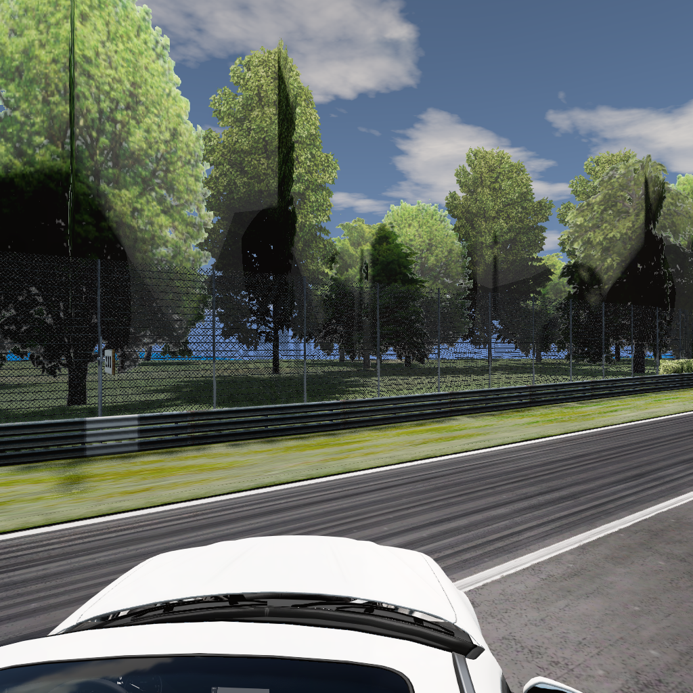
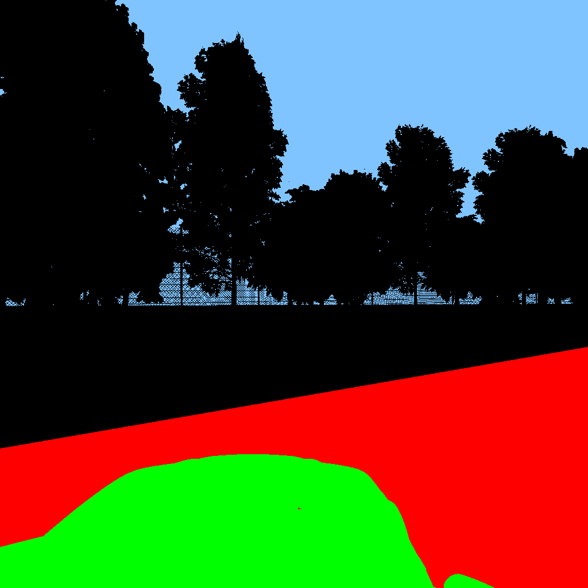

# Lane Segmentation via BeamNG from existing map

BeamNG.tech provides an out-of-the-box solution for gathering segmentation data with special render settings for more optimal data collection. Unfortunately, the map that we attempted to use this on does not work well with default techniques (the track is one large model, meaning object annotation does not give what we want, and material annotation is currently not working with the given map). Therefore, we devised a novel procedure to collect accurate base and annotated image pairs using BeamNGpy and the world editor (F11).

**Prerequisite: Map with transparent mesh road that follows the track wanted (see below):**

Base Image:

Image with Exposed Track:

_Note: The majority of this readme is a rehash of what is in the ipynb. For a better understanding, look at `bngseg.ipynb`. If there are any discrepancies, this readme and the `bngseg` package are more up-to-date. If confused, the notebook might be helpful._

# Quick start

The entire process is captured in `data_collection.py`. Run the script to quickly collect data. Change variables in the script to match what you need. Be sure to change mesh road material and opacity between collecting the base images and annotated images.

# Recording points from car

The way this workaround works is by teleporting the car randomly to a valid point, as defined by the user. One way to do this is to record points from a car's path, and then define a radius from this point such that any point within that radius is valid. The code below produces these points from a car's path, as controlled by the user.

In the package, the function for this is `record_points_from_car`.

# Defining function for random point generation

The function for random point generation is custom based on the use case, but the default implementation takes the output from recording the points from the user-controlled car and finds points within a radius of any of the generated points.

To use this default implementation, the function is `generate_random_point`.

# Generating images

To generate images, we capture images twice: once with a clear track as a base image and one with an opaque track as an annotated image. To do this, we keep track of where we want to capture images in the simulator. We do this here by recording points off a valid path, then taking points off a radius from that path.

_This is because annotation rendering takes into account material opacity, so the track won't show up in the annotated image when the track is clear, but we need it to be to capture track details._

First, attach cameras according to camera positions using `attach_cameras`. Then generate images using `generate_images`. Then pair and save images using `pair_images` and `save_images`. For a more clear description, take a look at the notebook or the function's docstrings.

For a complete data collection flow, take a look at the bottom of the notebook.

# Examples of generated images

Base Image:

Annotated Image:

